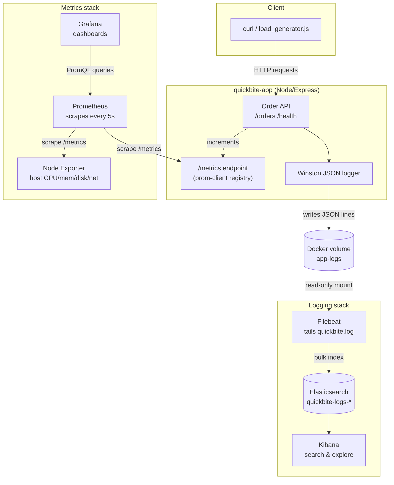

# Architecture (Part D.1)

## What each component does

- **quickbite-app** — the app being observed. Handles order placement, ready,
  and cancel. Every request updates Prometheus metrics in-process and writes
  one structured JSON log line via Winston.
- **Prometheus** — pulls (scrapes) `/metrics` from the app and from Node
  Exporter every 5 seconds and stores the time series in its own TSDB
  (`prometheus-data` volume).
- **Node Exporter** — a separate lightweight process that exposes host-level
  metrics (CPU, memory, disk, network) for the machine running Docker,
  labelled `machine="quickbite-dev-host"` in our Prometheus config.
- **Grafana** — queries Prometheus with PromQL and renders the dashboards in
  `grafana/dashboards/quickbite.json`, auto-provisioned on startup.
- **Filebeat** — tails the shared `app-logs` volume, parses each line as
  JSON (no Logstash needed since the app already emits structured logs),
  and ships events to Elasticsearch.
- **Elasticsearch** — stores log documents in daily indices
  (`quickbite-logs-YYYY.MM.DD`).
- **Kibana** — provides search/filter over the indexed logs.

## Data storage and why

- **Metrics** live in Prometheus's local TSDB (`prometheus-data` volume).
  We chose Prometheus's pull model because it decouples the app from
  needing to know where metrics are sent — Prometheus just needs network
  access to `app:3000/metrics`. Default retention is 15 days, fine for a
  class project.
- **Logs** live in Elasticsearch (`es-data` volume) as indexed JSON
  documents, one index per day, which makes it easy to age out old data
  by deleting old daily indices (see README "Log retention").
- Raw log lines also briefly exist inside the `app-logs` Docker volume
  (mounted read-only into Filebeat) as the JSON file the app writes to
  before Filebeat ships them onward.

## Failure behavior 

| Component stops | Effect |
|---|---|
| **app** | Prometheus scrapes fail (target shows `down`); no new logs are written; Grafana panels for app/business metrics flatline; existing data is untouched. |
| **Prometheus** | Grafana panels show "no data" for new points; the app keeps running and keeps exposing `/metrics`, but nothing is being scraped/stored until Prometheus comes back — metrics generated during the outage are lost (no buffering in Prometheus's pull model). |
| **Grafana** | No visualization, but Prometheus keeps scraping/storing normally; once Grafana restarts, historical data is still queryable. |
| **Node Exporter** | Only the host-metrics panels go stale; app/business metrics are unaffected since they come from a different target. |
| **Filebeat** | The app keeps writing to its log file inside the `app-logs` volume; nothing is lost as long as disk doesn't fill up. Once Filebeat restarts, its on-disk registry (the `filebeat-data` volume) remembers the last-read offset and resumes from there, forwarding the backlog. |
| **Elasticsearch** | Filebeat retries sending (its own internal queue/backoff); if the outage is long, Filebeat's registry still tracks the file offset so no data is lost once Elasticsearch is back — but the file itself must not be rotated away in the meantime. |
| **Kibana** | Just the UI is down; ingestion (Filebeat → Elasticsearch) is unaffected. |

